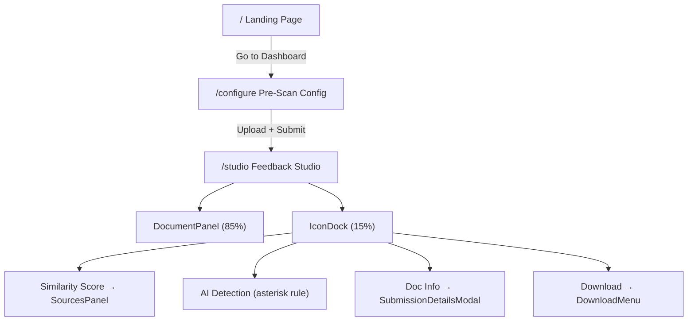

# Academic Originality Engine — Full UI/UX Overhaul

Complete refactor of the Originality Engine frontend from a dark-mode SaaS tool into an enterprise-grade, Turnitin-style academic integrity platform.

## User Review Required

> [!IMPORTANT]
> **Routing strategy**: I plan to add `react-router-dom` for page navigation (Landing → Pre-Scan Config → Feedback Studio). This is the standard approach for a multi-page React SPA. Please confirm this is acceptable.

> [!IMPORTANT]
> **shadcn/ui**: Your request mentions using `shadcn/ui` for stability. The current project uses Tailwind + custom components but has no shadcn/ui installed. I will **install and initialize shadcn/ui** (which adds a `components/ui/` directory) and use its Button, Dialog, Checkbox, DropdownMenu, and Sheet primitives. This keeps the UI consistent and accessible.

> [!WARNING]
> **Backend is untouched**: The Python backend (`main.py`, `scanner.py`, `search.py`, `sanitize.py`) will not be modified. All new UI screens will use **mock data** until you're ready to wire the real API.

## Open Questions

> [!IMPORTANT]
> **Institution name**: The "Search specific institution" checkbox currently says "University Grants Commission Repo" in your spec. The screenshot shows "Sri Balaji University, Pune". Which institution name(s) should appear? Or should it be a configurable text input?

> [!NOTE]
> **Firebase Auth**: You mentioned "Log In" as a placeholder for Firebase auth. I will render a non-functional "Log In" button on the landing page. Actual Firebase integration would be a follow-up.

---

## Proposed Changes

### Component 1: Design System & Configuration

Overhaul the entire color palette, typography, and theme from dark mode to a clean, light academic aesthetic.

---

#### [MODIFY] [index.html](file:///c:/Users/DELL/Documents/SIH%20Plag%20Checking/frontend/index.html)
- Remove `class="dark"` from `<html>` tag
- Update `<meta name="theme-color">` from `#0a0a0f` to `#ffffff`
- Update `<title>` and `<meta description>` to match new branding

#### [MODIFY] [index.css](file:///c:/Users/DELL/Documents/SIH%20Plag%20Checking/frontend/src/index.css)
- Replace all `:root` CSS custom properties with light-mode academic palette:
  - `--background`: white (`0 0% 100%`)
  - `--foreground`: near-black (`222 47% 11%`)
  - `--primary`: deep academic blue (`217 91% 40%`)
  - `--destructive`: clear red for plagiarism alerts
  - `--card`: white with subtle grey borders
  - `--muted`: light grey (`210 40% 96%`)
- Remove glassmorphism classes (`.glass-card`, `.glass-card-elevated`, `.gradient-text`)
- Add clean card styles with subtle shadows and crisp borders
- Update highlight classes for light backgrounds (red bg for plagiarism, blue bg for AI)
- Update scrollbar styles for light theme

#### [MODIFY] [tailwind.config.js](file:///c:/Users/DELL/Documents/SIH%20Plag%20Checking/frontend/tailwind.config.js)
- Remove `darkMode: 'class'`
- Update the `plagiarism` color to clear red (`0 72% 51%`)
- Update the `ai` color from purple to academic blue (`217 91% 50%`) to match spec
- Keep existing animation keyframes (they're useful)
- Keep Inter font family configuration

#### [MODIFY] [package.json](file:///c:/Users/DELL/Documents/SIH%20Plag%20Checking/frontend/package.json)
- Add `react-router-dom` dependency
- Dependencies audit: current deps are clean (framer-motion, lucide-react, react-dropzone, clsx, tailwind-merge, class-variance-authority — all useful, none conflicting)

---

### Component 2: Routing & App Shell

Add multi-page routing to navigate between Landing, Pre-Scan Config, and Feedback Studio.

---

#### [MODIFY] [main.tsx](file:///c:/Users/DELL/Documents/SIH%20Plag%20Checking/frontend/src/main.tsx)
- Wrap `<App />` in `<BrowserRouter>`

#### [MODIFY] [App.tsx](file:///c:/Users/DELL/Documents/SIH%20Plag%20Checking/frontend/src/App.tsx)
- Complete rewrite as a routing shell with `<Routes>`
- Three routes:
  - `/` → `<LandingPage />`
  - `/configure` → `<PreScanConfig />`
  - `/studio` → `<FeedbackStudio />`

---

### Component 3: Landing Page

A professional, university-grade landing page.

---

#### [NEW] [LandingPage.tsx](file:///c:/Users/DELL/Documents/SIH%20Plag%20Checking/frontend/src/pages/LandingPage.tsx)
- **Header**: Clean horizontal bar with:
  - Logo (shield/checkmark icon + "Originality Engine" text)
  - Right side: "Contact Support" link + "Log In" button (placeholder)
- **Hero Section**: 
  - Headline: "Empowering Academic Integrity"
  - Subtext about federated database scanning (OpenAlex, Crossref, CORE)
  - Primary CTA button: "Go to Dashboard" → navigates to `/configure`
- **Features strip**: 3–4 feature cards (Similarity Detection, AI Writing Detection, Federated Search, Institutional Repository)
- **Footer**: Simple copyright line
- All on white/slate-50 background, deep blue accents, high whitespace

---

### Component 4: Pre-Scan Configuration

Checkbox-based database selection screen before scanning.

---

#### [NEW] [PreScanConfig.tsx](file:///c:/Users/DELL/Documents/SIH%20Plag%20Checking/frontend/src/pages/PreScanConfig.tsx)
- Clean card with "Customize Your Search" heading (matching the Turnitin screenshot)
- Four checkboxes, all checked by default:
  - `[x]` Search the internet
  - `[x]` Search student papers (Internal Repo)
  - `[x]` Search periodicals, journals, & publications (OpenAlex / Crossref)
  - `[x]` Search specific institution (e.g., University Grants Commission Repo)
- Each checkbox has a brief description line beneath it
- "Submit papers to:" dropdown (mock: "standard paper repository" / "no repository")
- **Upload zone**: integrated `react-dropzone` area below config
- On file upload → navigates to `/studio` with file + config state

---

### Component 5: Feedback Studio (Core Workspace)

The Turnitin-style split workspace with document viewer + floating icon dock.

---

#### [NEW] [FeedbackStudio.tsx](file:///c:/Users/DELL/Documents/SIH%20Plag%20Checking/frontend/src/pages/FeedbackStudio.tsx)
- **Layout**: Full-height split — 85% left (Document Viewer), 15% right (Icon Dock)
- **Top bar**: Student name (mock), navigation arrows, help icon
- Manages all scan state (results, active panels, modals)
- Uses mock data to demonstrate all UI states

#### [NEW] [DocumentPanel.tsx](file:///c:/Users/DELL/Documents/SIH%20Plag%20Checking/frontend/src/components/DocumentPanel.tsx)
- Takes up 85% width
- Renders document text with color-coded overlays:
  - Red/pink background for plagiarism-flagged sentences
  - Blue background for AI-flagged sentences
- Clean white background, readable typography
- Scrollable with page-like formatting

#### [NEW] [IconDock.tsx](file:///c:/Users/DELL/Documents/SIH%20Plag%20Checking/frontend/src/components/IconDock.tsx)
- Vertical stack of square/circular icon buttons (15% width, right side)
- Light grey background, subtle borders
- **Icons implemented** (top to bottom):
  1. **Layers icon** (document layers toggle)
  2. **Similarity Score** — Red square with score (e.g., "24%"). Click → opens `<SourcesPanel />`
  3. **Filter icon** — Opens filter menu (exclude quotes, exclude bibliography)
  4. **AI Detection** — Blue icon labeled "AI". 
     - **Critical rule**: If `ai_probability < 0.10`, display `* %` instead of the number
  5. **Document Info** — Grey "i" icon. Click → opens `<SubmissionDetailsModal />`
  6. **Download** — Grey download icon. Click → opens contextual menu with 3 options

#### [NEW] [SourcesPanel.tsx](file:///c:/Users/DELL/Documents/SIH%20Plag%20Checking/frontend/src/components/SourcesPanel.tsx)
- Slide-out panel (overlays or pushes from right)
- Lists matched sources with:
  - Source title
  - Similarity percentage
  - DOI link (clickable)
  - Database source (OpenAlex / Crossref / CORE badge)

#### [NEW] [SubmissionDetailsModal.tsx](file:///c:/Users/DELL/Documents/SIH%20Plag%20Checking/frontend/src/components/SubmissionDetailsModal.tsx)
- Modal titled "Submission Details" (matching the Turnitin screenshot exactly)
- Table of details:
  - Submission ID, Date/Time, File Name, File Size, Page Count, Word Count, Character Count
- Clean two-column layout, close button (X)

#### [NEW] [DownloadMenu.tsx](file:///c:/Users/DELL/Documents/SIH%20Plag%20Checking/frontend/src/components/DownloadMenu.tsx)
- Small contextual dropdown/popover with 3 options:
  1. Current View (PDF report with highlights)
  2. Digital Receipt
  3. Originally Submitted File
- Each with a download icon, styled like the Turnitin screenshot

---

### Component 6: Mock Data & Types

---

#### [MODIFY] [types.ts](file:///c:/Users/DELL/Documents/SIH%20Plag%20Checking/frontend/src/types.ts)
- Add `SubmissionDetails` interface (id, dateTime, fileName, fileSize, pageCount, wordCount, charCount)
- Add `ScanConfig` interface (searchInternet, searchStudentPapers, searchJournals, searchInstitution)
- Keep existing `ChunkResult`, `MatchInfo`, `SanitizationInfo`, `ScanStatus`

#### [NEW] [mockData.ts](file:///c:/Users/DELL/Documents/SIH%20Plag%20Checking/frontend/src/data/mockData.ts)
- Comprehensive mock data for:
  - A full document with ~6 text chunks (some flagged plagiarism, some AI, some clean)
  - Mock matches with real-looking DOIs and source names
  - Mock submission details
  - Mock sanitization info
- This allows the entire UI to be demonstrated without the Python backend

---

### Component 7: Cleanup

---

#### [DELETE] [Uploader.tsx](file:///c:/Users/DELL/Documents/SIH%20Plag%20Checking/frontend/src/components/Uploader.tsx)
- Replaced by the upload zone in `PreScanConfig.tsx`

#### [DELETE] [ScannerDashboard.tsx](file:///c:/Users/DELL/Documents/SIH%20Plag%20Checking/frontend/src/components/ScannerDashboard.tsx)
- Replaced by `IconDock.tsx` + panel components

#### [DELETE] [ResultCard.tsx](file:///c:/Users/DELL/Documents/SIH%20Plag%20Checking/frontend/src/components/ResultCard.tsx)
- Replaced by `SourcesPanel.tsx`

#### [KEEP] [DocumentViewer.tsx](file:///c:/Users/DELL/Documents/SIH%20Plag%20Checking/frontend/src/components/DocumentViewer.tsx)
- Will be significantly refactored into `DocumentPanel.tsx` but can be deleted after the new component is in place

---

## Architecture Summary



## File Structure After Refactor

```
frontend/src/
├── main.tsx
├── App.tsx                          (routing shell)
├── index.css                        (light academic theme)
├── types.ts                         (updated with new interfaces)
├── lib/
│   └── utils.ts                     (unchanged)
├── data/
│   └── mockData.ts                  (NEW — mock data)
├── pages/
│   ├── LandingPage.tsx              (NEW)
│   ├── PreScanConfig.tsx            (NEW)
│   └── FeedbackStudio.tsx           (NEW)
└── components/
    ├── DocumentPanel.tsx            (NEW)
    ├── IconDock.tsx                 (NEW)
    ├── SourcesPanel.tsx             (NEW)
    ├── SubmissionDetailsModal.tsx   (NEW)
    └── DownloadMenu.tsx             (NEW)
```

## Verification Plan

### Automated Tests
1. Run `npm run dev` — must start with **zero terminal errors or warnings**
2. Run `npx tsc --noEmit` — must produce **zero TypeScript errors**
3. Visit each route in browser:
   - `http://localhost:5173/` — Landing page renders correctly
   - `http://localhost:5173/configure` — Pre-scan config with checkboxes
   - `http://localhost:5173/studio` — Feedback Studio with mock data, icon dock functional
4. Click every icon in the dock — verify panels/modals open correctly
5. Verify the AI `* %` rule: mock data includes a chunk with `ai_probability = 0.06` which should display `* %`

### Manual Verification
- Visual review of light-mode aesthetic against the Turnitin screenshots provided
- Ensure responsive behavior (the layout should work on standard desktop widths)
